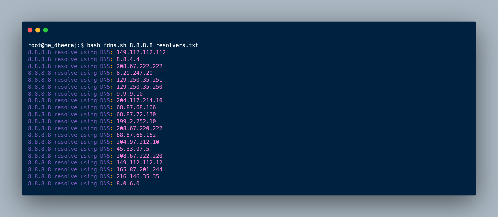

# fdns
A small peace of code to resolve IP/Domain with specified NS to check the correct resolver.

```
Usage:
Download Resolvers: https://raw.githubusercontent.com/Dheerajmadhukar/subzzZ/main/lists/resolvers.txt
#bash fdns.sh x.x.x.x resolvers.txt
OR
#bash fdns.sh target.com resolvers.txt
```
<h1 align="left">
  </a>
  <br>
</h1>
